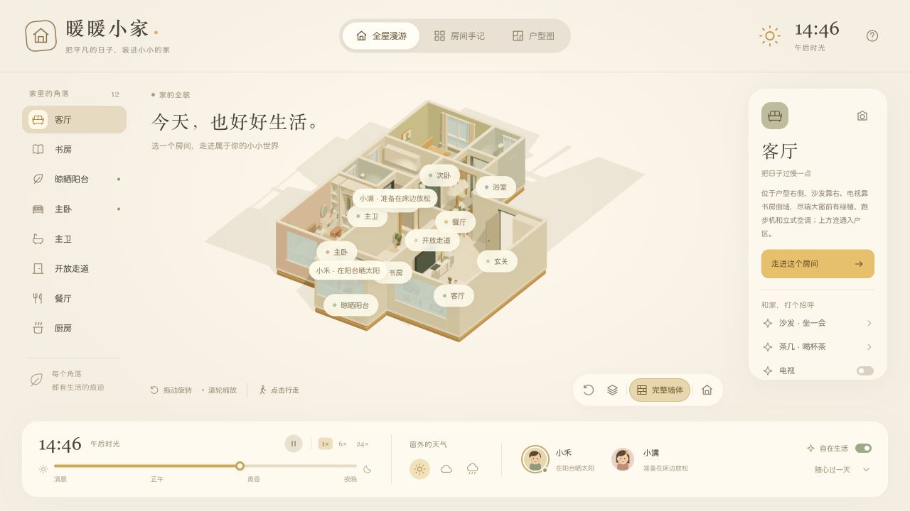
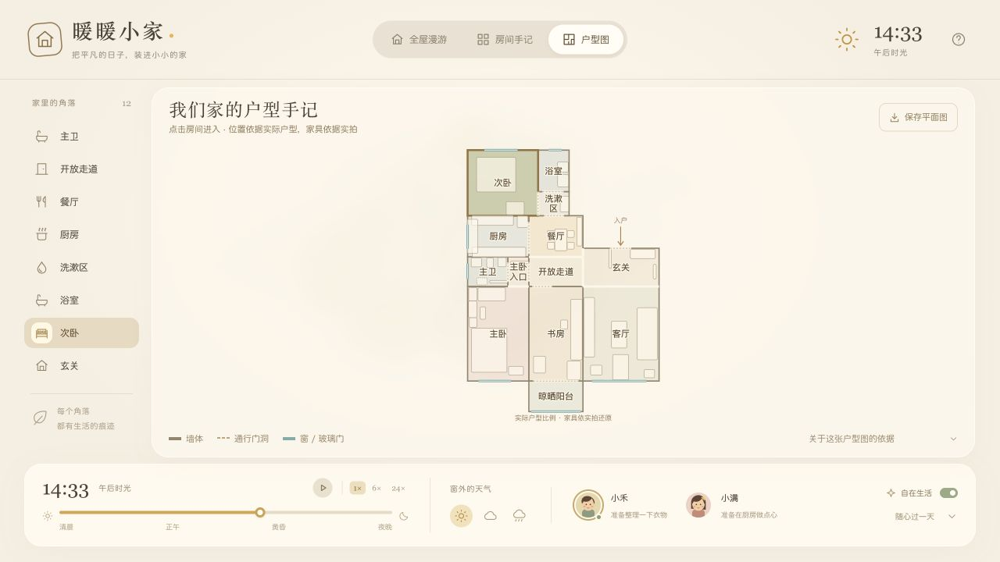
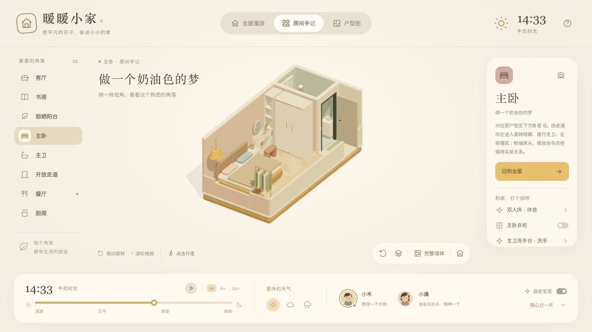
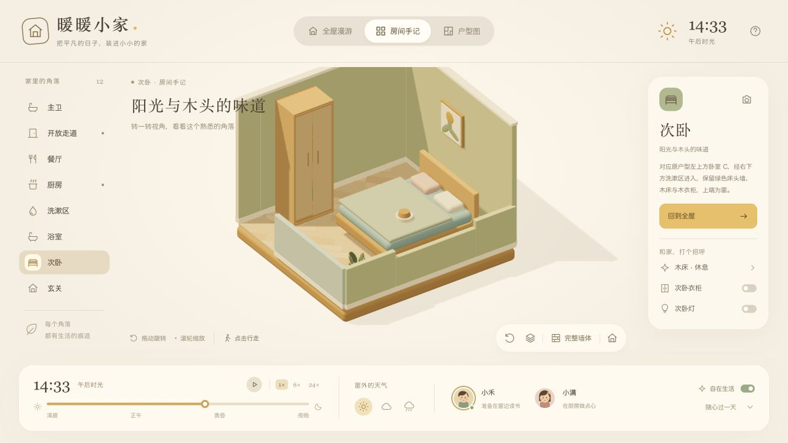
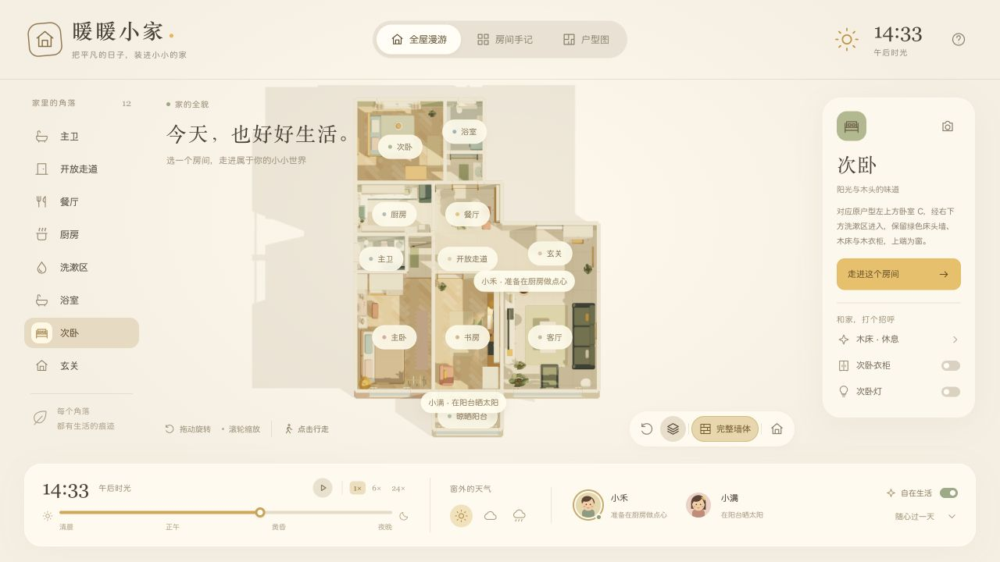
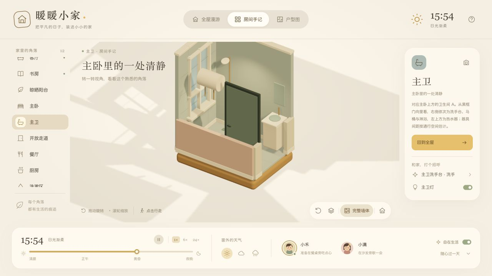

# Photo to Cozy Home

> 把一组家庭照片还原成可漫游、可交互、会随时间变化的 Q 版 WebGL 小家。


本 Skill 让用户只需提供家中各个房间和角落的照片，就能开始还原住宅。若有户型图，它会优先用来校准墙体、门窗和尺寸关系；若没有，它会根据照片中的门框、窗户、地面分界和重复家具推算空间连接，并向用户确认少量真正影响布局的问题。

**本 Skill 由 GPT 6 Astra 创作，并使用 GPT 6 Astra 完成首个完整案例和验收。其他模型可自行尝试，实际完成度、空间推理和长流程稳定性可能不同。**

## 能做什么

- 从照片识别房间、家具、门窗和空间连接，构建带证据标记的平面图。
- 基于同一份户型数据生成暖黄色、圆润 Q 版 WebGL 三维住宅。
- 单独打开每个房间，旋转、缩放、俯视，并在完整墙体和剖面之间切换。
- 让电脑、电视、灯、台灯、衣柜、沙发和书桌产生可见的交互结果。
- 放置一名小男孩和一名小女孩，支持手动行走、自主活动和简单作息。
- 模拟清晨、正午、黄昏、夜晚以及晴天、多云和下雨对室内外光线的影响。
- 在用户补充照片或纠正户型后，同步更新墙体、家具、导航、挂画、相机和平面图。

## GPT 6 Astra 验收案例

下面的图片来自最新验收案例。仓库只收录生成后的模型截图，不包含用户提供的原始家庭照片、地址或人物照片。

### 从全屋布局到可操作的小家



全屋视图保留房间选择、人物状态、时间轴、天气和交互入口。人物在同一套世界坐标内活动，进入单房间视图时不会被瞬移。

### 平面图与三维模型共用布局数据



房间边界、开放连接、门窗、家具占地和三维模型来自同一份数据。案例中根据用户后续提供的户型图校正了玄关、餐厅、开放走道，并完成主卧与次卧整房对调。

### 房间级还原

| 主卧套间 | 次卧 |
| --- | --- |
|  |  |

主卧保留寝区、入口短廊和套内卫浴；次卧保留木床、木衣柜、窗和墙面装饰。衣柜支持打开与合上，墙上装饰会受真实墙段边界约束。

### 开放空间与墙体关系



客厅、餐厅、玄关和走道可以分别选择，但开放连接处不会凭空出现横梁、门框、立柱或隐形碰撞墙。实体共用墙只生成一次，避免重叠闪烁。

### 套内卫浴



卫浴依据用户补充的视角信息布置洁具和热水器，同时纳入人物通行、门扇开合和家具碰撞检查。

该案例的最终验收包括：

- 41 项自动化检查全部通过。
- 4 个固定随机种子分别进行 10 分钟双人自主活动模拟，检查持续到达、人物间距、墙体和家具碰撞。
- 浏览器实际验证全屋/单房间切换、视角旋转、完整墙体/剖面、电脑与灯光、衣柜开合、人物跨房间活动、昼夜和天气。
- 浏览器控制台无 error 或 warn。
- 挂画完整几何保持在真实墙面内，避开门窗和开放通道。

这些数字是 GPT 6 Astra 首个参考案例的实际结果，不是 Skill 对每套住宅预设的固定测试数量。Skill 会按项目范围生成和执行相应检查。

## 使用方法

将仓库克隆到 Codex skills 目录：

```bash
git clone https://github.com/Clarklevis1995/photo-to-cozy-home.git ~/.codex/skills/photo-to-cozy-home
```

然后在 Codex 中附上家庭照片并输入：

```text
使用 $photo-to-cozy-home，把我家做成一个可以互动的 Q 版 3D 小家。
```

用户可以只提供照片。更完整的输入通常包括：

- 各房间和连接处的照片，尤其是门口朝向两个空间拍摄的照片；
- 可选的户型图、尺寸或房间名称；
- 可选的风格参考图；
- 哪些家具需要交互，以及人物和时间系统的偏好。

若没有户型图，Skill 会先拼接候选平面布局，并询问类似“站在卧室门口向里看，卫生间门在正前方还是右侧？”这样的具体问题。它不会要求用户先完成一份冗长问卷，也不会把照片顺序当成确定的空间连接。

## 工作原则

空间连通和家具关系优先于装饰效果。Skill 会区分已确认信息、有依据的推断和未知项，并将用户纠正写回同一份布局数据。它包含针对以下常见问题的约束：

- 共用墙重复、墙面冲突和开放空间出现虚构门框；
- 房间名称换了，但家具、卫浴和人物路线没有一起移动；
- 人物在窄门、书房或相向行走时永久卡住；
- 衣柜门穿过家具或打开后没有真实内部；
- 挂画越过墙边、覆盖门窗或悬在开放通道上；
- 单房间视图和平面图使用了不同坐标。

## 仓库结构

```text
photo-to-cozy-home/
├── SKILL.md
├── agents/openai.yaml
├── references/
│   ├── reconstruction.md
│   ├── implementation.md
│   └── validation.md
└── assets/showcase/
```

- [SKILL.md](SKILL.md)：入口、适用范围、工作流程和交付规则。
- [reconstruction.md](references/reconstruction.md)：从照片和可选户型图推导空间。
- [implementation.md](references/implementation.md)：WebGL 建模、家具、人物、灯光和交互约束。
- [validation.md](references/validation.md)：结构、导航、浏览器和交付验收场景。

## 隐私与限制

家庭照片默认只留在当前用户的本地项目中，不应复制进 Skill 模板或未经授权上传。公开案例应只使用用户明确允许的生成结果，并移除地址、人物照片和其他可识别信息。

照片推导的尺寸和未拍透区域属于估计，不能替代建筑测绘、结构安全评估或真实日照分析。没有现场尺寸时，成品应清楚标注可继续校准的部分。

## 模型说明

创建与首个案例验证模型：**GPT 6 Astra**。

其他模型可以直接加载本 Skill 自行尝试。建议特别观察它们在多图空间拼接、用户纠错后的全局同步、双人导航长测和浏览器实际验收上的表现。
