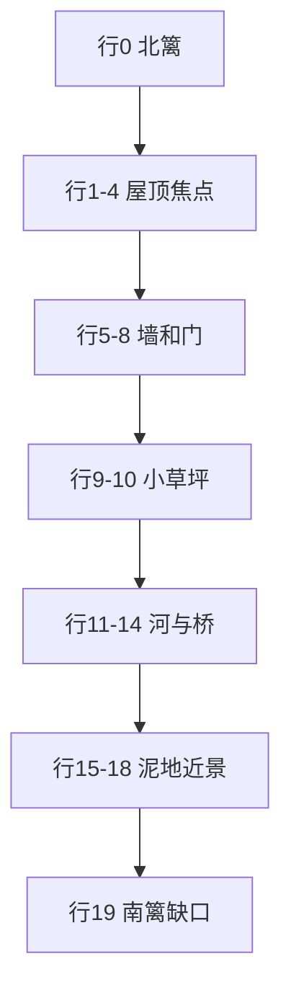

# 乐园室外画面设计

> **已取代。** 农舍构图（泥地、木篱、河、粉三角屋顶）不再采用。室外室内建筑以 `docs/乐园建筑美术设计.md` 为准。下文只保留 16 位原则作历史记录。

本文只定**室外那一屏怎么好看**。产品规则见 `docs/乐园系统设计方案.md`，室内另写。未写进本文的装饰默认不画。

画布是死的：逻辑 **240×320**，瓦片 **16×16**，正好 **15 列 × 20 行**。外壳再 FIT 放大，构图按这 300 格锁死，不随手机拉伸改布局。

---

## 1. 这一屏要看起来像什么

不是绿操场，也不是空农场。是**篱笆围起来的小园**：泥地占大半，粉屋顶小屋是唯一主角，一条小河横过，石径从南门过桥接到屋门。树和花成簇，不撒胡椒面。

参考的是 16 位机上的 3/4 俯视（能看见屋墙和三角屋顶），不是纯正上方。光从**左上**来：左边、上边亮一档，右边、下边暗一档。没有雾、没有渐变、没有抗锯齿。

Blysch 的纸色、墨线、金、玫瑰已经在产品里。室外跟这套走：泥土用金棕，屋顶用玫瑰，草只当点缀。整屏像一张贴在本子上的像素明信片。

---

## 2. 16 位为什么好看（本屏用这些，其它不用）

| 原则 | 本屏怎么做 |
|------|------------|
| 一个焦点 | 粉屋顶。其它颜色都比它灰、比它矮。 |
| 有限色 | 全场景约 32 色，见第 5 节。同材质最多亮/中/暗三档。 |
| 能认轮廓 | 屋、树、桥、门在 16px 格上剪影仍能认，不靠细节堆。 |
| 成团，不均铺 | 花三五朵一丛；草三块；树四个角。泥地留空。 |
| 引导线 | 2 格宽石径，从南篱笆缺口穿过桥，直通屋门。眼睛顺着路走。 |
| 前后遮挡 | 屋顶、树冠盖在角色上面；角色走在墙脚和桥上。 |
| 硬边 | 1px 墨线 `#1c1917`。禁止模糊、圆角、半透明叠色。 |

不要做：整屏草坪、彩虹花、超大屋顶、没有河岸的蓝条子、CSS 三角形屋顶、左右完全对称的贴图。

---

## 3. 画面分区（20 行怎么切）

竖着四段，比例固定：

```
行  0        北篱笆
行  1–4      远树冠 + 屋顶（远景）
行  5–8      屋墙、门、窗；左右夹一点园圃
行  9–10     屋前小草坪 + 石径（中景停顿）
行 11–14     河岸 / 河 / 桥
行 15–18     近处泥地、近景树、花丛
行 19        南篱笆，正中 2 格是缺口（路的起点）
```

横着：左右各 1 格篱笆。屋子占中间 9 格（列 3–11），两边留给树，屋不会顶满屏幕。



河在画面偏下、屋在偏上，符合三分：上段住建筑，下段住水。桥在列 6–8，路在列 6–7，门也在列 6–7，一条轴贯通，但仍略偏左（15 列的正中是列 7），避免死对称。

---

## 4. 逐格总图

坐标：列 0–14 从左到右，行 0–19 从上到下。每个字符一格。

```
      0 1 2 3 4 5 6 7 8 9 A B C D E
  0   F F F F F F F F F F F F F F F
  1   F T T . / / / / / C C . T T F
  2   F T T / / / / / / / C . T T F
  3   F t . / / / / / / / / / t . F
  4   F . . / / / / / / / / / . . F
  5   F * g . W n W W n W W g * . F
  6   F g g . W W W W W W W g T T F
  7   F . . . W W D D W W W . T T F
  8   F . . . W W D D W W W . t . F
  9   F . * * g g P P g g * * . . F
 10   F . . g g g P P g g g . . . F
 11   F K K K K K K B B B K K K K F
 12   F A A A A A A B B B A A A A F
 13   F A A A A A A B B B A A A A F
 14   F K K K K K K B B B K K K K F
 15   F T . . . . . P P . . . . T F
 16   F T T * * . . P P . . * T T F
 17   F t . . . . . P P . . . t . F
 18   F . . . . . . P P . . . . . F
 19   F F F F F F F P P F F F F F F
```

未写出的格子是泥地 `E`。`.` 也是泥地，只是为了读图留空。

| 符 | 是什么 | 走得过 | 备注 |
|----|--------|--------|------|
| `F` | 木篱笆 | 否 | 四周一圈；行 19 列 6–7 换成路，当南门 |
| `T` | 树冠 | 否 | 盖在角色之上 |
| `t` | 树干 | 否 | 占 1 格 |
| `/` | 粉瓦屋顶 | 否 | 只画，脚底下的碰撞用墙的足迹 |
| `C` | 烟囱 | 否 | 2×2，偏屋顶右侧 |
| `W` | 奶油墙 | 否 | 足迹列 4–10、行 5–8 |
| `n` | 窗 + 花箱 | 否 | 墙的一部分 |
| `D` | 门 | 重叠进室内 | 2×2，触控热区至少扩到 3×3 逻辑像素外再对 44px |
| `g` | 草坪 | 是 | 一共三块，见下 |
| `P` | 混色石径 | 是 | 始终 2 格宽 |
| `B` | 木桥 | 是 | 盖在水上，水在桥下仍画、不碰撞 |
| `A` | 河 | 否 | 2 行深 |
| `K` | 河岸 | 是 | 泥 + 碎石，比水亮 |
| `*` | 花丛 | 是 | 不挡路 |
| `E` / `.` | 泥地 | 是 | 主面积 |

### 三块草坪（必须小）

1. 屋前：行 9–10，列 4–10，被石径列 6–7 切开。这是最大的一块，仍只有两行。
2. 屋左：行 5–6，列 1–2。篱边小圃。
3. 近景右：行 16，列 11 那一格并入右侧花丛即可，**不要**再铺一整块。近景以泥地为主。

草的总格数大约 20，泥地大约 90+。草再多就会回到操场。

### 树（四簇，角上）

| 位置 | 树冠 | 树干 |
|------|------|------|
| 西北 | 行 1–2，列 1–2 | 行 3，列 1 |
| 东北 | 行 1–2，列 12–13 | 行 3，列 12 |
| 西南 | 行 15–16，列 1–2 | 行 17，列 1 |
| 东南 | 行 15–16，列 12–13；行 6–7 列 13 可再探出一点冠 | 行 17，列 13 |

树冠 2×2 起步，不要 5×5 的球。东北那棵不要压住烟囱。

### 小屋（萌，但是像素台阶，不是矢量三角）

屋顶行 1–4、列 3–11，每行加宽，形成台阶三角：

- 行 1：列 4–8 瓦 + 列 9–10 烟囱
- 行 2：列 3–9 瓦 + 列 10 烟囱下沿
- 行 3：列 3–11 瓦
- 行 4：列 3–11 瓦（屋檐探出墙外各 1 格）

墙行 5–8、列 4–10。窗在行 5：列 5 与列 8。门行 7–8、列 6–7。窗下各 1 格花箱（粉色条，不是第二栋建筑）。

墙脚一行略深的木色踢脚，把门从墙里托出来。门板深玫瑰棕，一颗金门把手（2×2 像素就够）。

角色不能走进屋顶格子。能走的是屋前泥地/草/路，以及绕到墙两侧的空泥地（列 2–3、列 11–12 的行 5–8，视树干占用而定）。

### 河与桥

- 河心：行 12–13，列 1–13（列 0/14 仍是篱笆）
- 北岸行 11，南岸行 14，同宽
- 桥：列 6–8，行 11–14，木板横纹，两侧各 1px 墨线栏杆
- 水要有岸：北岸略亮、南岸略暗（光从左上，南岸等于背光）
- 水里加少量 2×2 亮点当波光，不要画鱼、不要画倒影屋

桥面材质是木头，不要再铺石子。石径在桥北接到门，桥南接到南篱缺口，在桥上中断换成木板，这才像「路过水」。

### 石径

列 6–7 贯通：行 9–10（草里）、行 15–18（泥里）、行 19（篱笆缺口）。行 11–14 让给桥。

砖要混色：同一条路上至少三种灰米色交替，缝是墨色 1px，错缝（下一行砖缝错开 8px），不要整条一种灰。

---

## 5. 色板（锁死）

全场景只用这些。不够就改明度，不新开色相。

| 用途 | 暗 | 中 | 亮 |
|------|----|----|----|
| 墨线 | `#1c1917` | — | — |
| 泥地 | `#6b4a2a` | `#8c6a45` | `#c4a06a` |
| 碎石点 | `#8a8474` | `#9aa08c` | `#d4cbb8` |
| 草 | `#2f6a22` | `#3d7a28` | `#8fd45a`（高光极少） |
| 水 | `#2c5a80` | `#3d7ab0` | `#5aa4d4` / 沫 `#c8e8ff` |
| 屋顶 | `#c45a6e` | `#e07a8c` | `#f0a0b0` |
| 墙 | `#f0c4b4` | `#ffe8d4` | `#fff8ec` |
| 木（篱、桥、门） | `#5a3a1e` | `#6b4a2a` | `#8b6239` |
| 花 | `#ee99ac` | `#e4c36a` | `#fff8ec` |

泥地是面积色，必须比草、比屋顶都闷。草一旦比泥地还抢，整屏会花。

---

## 6. 图层（从下往上）

和 Phaser 方案里的图层对齐，室外这一屏具体是：

1. `ground`：泥、草、石径、河岸。可走。
2. `water`：河心。碰撞。
3. `bridge`：木桥。可走，关掉桥下的水碰撞。
4. `walls`：篱笆、墙足迹、树干。碰撞。
5. `deco`：花、窗箱、烟囱装饰、家具。花不碰撞。
6. `actors`：宠物 / 访客（实现时才加）。
7. `overlay`：屋顶、树冠。不挡走（碰撞已在足迹），但画在角色上面。

屋顶用 overlay，角色可以走到门前而不被整栋房子吞掉，又保持 3/4 的「屋在人后面」。

---

## 7. 家具落点（不改解锁规则，只占格）

室外已解锁件放在空泥地/篱边，**不准压路、不准压门、不准压桥**：

| id | 格子 |
|----|------|
| `cow-porch` | 行 6 列 8（门楣右侧） |
| `rabbit-chime` | 行 5 列 9（右窗旁屋檐，overlay） |
| `rabbit-swing` | 行 6–8 列 1（屋左泥地，西北树下） |
| `rabbit-bed` | 行 9 列 2–3（屋前草左，篱边花圃） |
| `cow-box` | 行 1 列 12（北篱内侧） |
| `cow-trough` | 行 16 列 4（河南，路左） |
| `cow-mill` | 行 16 列 9（河南，路右） |

未解锁不画。两件相邻至少隔 1 格空泥，避免堆成货架。

---

## 8. 角色站位与走位空档

当日在院子的宠物，待机格：**行 10 列 5** 与 **行 10 列 8**（屋前草、路两侧）。两只同一天都在院子则左右错开，不站到 `P` 上。

玩家要从南篱缺口走进来，所以行 15–18 列 6–7 必须一直空着可走。摇杆活动范围：所有 `E/g/P/B/K/*`，不能进 `F/A/W/T/t` 和屋顶足迹。

---

## 9. 动效（画面设计里允许的上限）

本期可以没有动画。若做，只准这些，且 `prefers-reduced-motion: reduce` 时全停：

- 水面：4 帧，只换亮点位置，色不超出第 5 节。
- 烟囱：2 帧白像素「烟」，2×3 像素，不要大团。
- 花：不要摆。

不要草浪、树摇、闪光粒子。16 位的静，比乱闪好看。

---

## 10. 和现在 CSS 院子的差别

现在的 HTML 院子问题是：泥地纹理在整屏平铺、草坪色仍偏抢、河是一条宽色带、屋顶是 `clip-path` 三角、花和树是散点。看起来像贴纸，不像一张画好的图。

按本文做完应变成：

- 草很少，泥地是底。
- 河有岸、有深浅、有桥把画面接起来。
- 屋顶是台阶像素，烟囱、窗箱、金门把手都在格上。
- 树在四角压住篱笆，增加「篱外还有世界」。
- 路是一条事，不是屋门底下凭空垂一条砖。

---

## 11. 验收（只看室外静帧）

1. 缩到 240×320 仍能立刻认出：篱笆、粉屋、河、桥、路。
2. 草的格子数明显少于泥地。
3. 屋顶是最饱和的色块；草、泥、水都比它闷。
4. 从南篱缺口可以沿 2 格路走到门，中途必须过桥。
5. 左右不是镜像。烟囱在右，秋千在左。
6. 没有半透明、没有模糊、没有非 16 倍数的圆角屋顶。
7. 放大到手机宽度（约 2 倍）时，砖缝仍是清晰的 1px 墨线。

画对了再接到 Phaser 的 `YardScene`。这一篇不规定代码。
