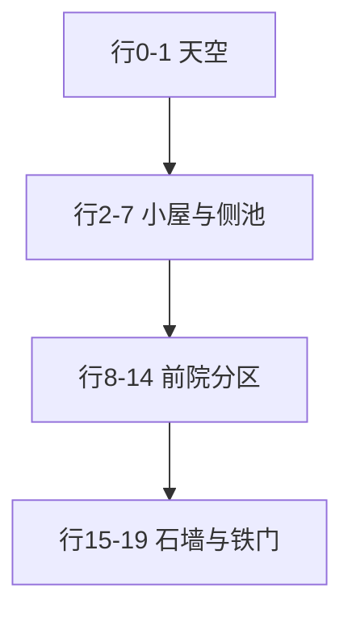

# 乐园建筑美术设计

像素风已定。本文改的是**建筑类型、场地布局、材料审美**。产品规则仍以 `docs/乐园系统设计方案.md` 为准：两人共用一座屋、默认室外、点门进出、家具按等级解锁、HTML + CSS 像素布景。

本文取代 `docs/乐园室外画面设计.md` 里的农舍构图（泥地、木篱、河、粉三角屋顶）。那一篇的 16 位原则（一个焦点、有限色、硬边、成团）仍然有效，场地和房子换掉。

未写进本文的装饰默认不画。

---

## 1. 这一座屋要像什么

不是星露谷小农舍，也不是玻璃方盒子豪宅。参考的是**洛杉矶西区独栋的西班牙复兴住宅**（Beverly Hills / Los Feliz / Hancock Park 一带）：奶油灰泥墙、低坡赤陶瓦顶、拱门、铁艺、棕榈、九重葛、修剪过的前院。

一句话：情侣本子里的「我们的房子」，看起来像南加州富人区一栋被晒过的独栋，不是农场，也不是酒店大堂。

### 为什么定这一支，不定别的

| 候选 | 弃用原因 |
|------|----------|
| 农舍 / 谷仓 | 现在就是这个。木篱、河、粉屋顶、食槽，像玩具村。 |
| 纯白当代（Trousdale 玻璃盒） | 16px 上只剩白方块，认不出「洛杉矶」。 |
| 都铎砖屋 / 英伦 | 太冷、太北，和本子的纸色、玫瑰对不上。 |
| 马里布悬崖现代 | 需要海和纵深，一屏装不下。 |

西班牙复兴在像素里轮廓清楚：瓦顶是色块主角，棕榈剪影一眼能认，拱门就是进门按钮。室内的灰泥、拱洞、陶土地板也用现有 CSS 矩形叠得出来。

### 这一屏不是洛杉矶的什么

- 不画好莱坞招牌、市中心天际线、高速公路。
- 不画车库顶满门面的 McMansion。
- 不画后院泳池派对、不画横贯屏幕的大水。室外仍是**临街立面 + 前院**；泳池只允许**右侧院一条窄水**，贴着屋墙南北向，不当眼睛的主轴。
- 不把「有钱」做成镀金、喷泉巨人、十扇窗。克制、晒白、植物比装饰多，才像那一带的独栋。

---

## 2. 现在为什么不像

对照现行 `YardScenery` / `HouseScenery` 和 Kenney Tiny Town 试做：

| 现状 | 问题 | 本文改成 |
|------|------|----------|
| 四周木篱笆 | 农舍地块 | 南侧石墙 + 铁门，左右绿篱，北侧露出天空 |
| 泥地铺满、草是补丁 | 操场或旱田 | 整块修剪草坪，硬质铺装切开 |
| 河 + 木桥过中轴 | 乡下溪流 | 前院小喷泉 + 右侧院窄泳池，都不是河 |
| `clip-path` 粉三角屋顶 | 矢量贴纸，不像瓦 | 台阶式赤陶瓦垄，低坡、横向铺开 |
| 房子又高又居中 | 童话小木屋 | 横向体量，墙矮、檐长，略偏右 |
| 四角各一棵圆树冠 | 欧洲果园 | 两棵华盛顿棕榈当门卫，九重葛爬墙 |
| 室内壁炉、谷仓木地板、花墙纸 | 农舍室内 | 白灰泥、客厅陶土砖、卧室橡木、黑钢窗、拱形门洞 |
| 家具是灯笼、食槽、石磨 | 牧场道具 | 同一批 id，外形改成能住进这栋屋的物件 |
| Kenney Tiny Town / Dungeon | 欧式小镇 + 地牢 | **不用**。那套图没有灰泥、铁艺、棕榈、拱门 |

审美问题不在「像素不够细」，在**建筑类型选错了**。换瓦片引擎也救不了农场素材。

---

## 3. 技术栈能做什么

生产路径锁死为当前乐园页那套：**React 绝对定位 + CSS 像素块**，场景容器 `image-rendering: pixelated`，硬边墨线。`docs/乐园系统设计方案.md` 写明：不做画布引擎、不做瓦片地图、不做整张 PNG 场景。

仓库里的 `dream-pixi.tsx` + Kenney 图集是另一条实验，**本方向不采用**。Tiny Town 是草地农舍语汇，重着色也变不成洛杉矶独栋；引入 Pixi 还要把宠物、门热区、ViewTransition 再接一遍，收益是农场画质，不是我们要的房子。

### 做得到（本方案只用这些）

- 16×16 逻辑格上的矩形、台阶轮廓、1–2px 墨线。
- `repeating-linear-gradient` 做瓦垄、草坪修剪纹、陶砖缝、铁栏杆。
- 成团的装饰块（棕榈冠、九重葛、龙舌兰），不是散点。
- 拱门用**像素台阶**（每级 2–4px），不用 `border-radius`。
- 屋顶用逐行加宽的瓦条，不用 `clip-path` 三角。
- 场景逻辑画布 **240×320**（15×20 格），外壳 FIT 放大到现有约 640px 高；构图按格锁死，禁止 `left: 44%` 这种随屏宽漂移的定位。
- 家具继续走 `FurniturePiece` 的 CSS 积木，不单独做精灵表。
- 室内外仍是同页 `scene` 切换，门是 `button`，热区 ≥ 44px。

### 做不到，所以构图要让步

| 做不到 | 构图上怎么让 |
|--------|----------------|
| 真 3D 透视、曲面瓦、柔软树冠 | 只靠剪影和三档明度 |
| 一屏里的纵深街区 | 前院 + 立面，篱外只露棕榈梢和一条天 |
| 复杂铁艺花纹 | 铁门 = 竖条 + 一条横档 + 一点枪头 |
| 整墙手绘灰泥颗粒 | 墙面两档奶油色分带（受光 / 踢脚），禁止噪声贴图和模糊 |
| 玻璃反射、水面倒影房子 | 池/泉只有硬边亮点和一档深浅 |
| 随等级改建、加层、加侧翼 | 房屋体量永远同一座，只往固定槽里摆家具 |

### CSS 禁令（违反就会回到贴纸）

- 禁止 `clip-path` 做屋顶、树、山。
- 禁止 `border-radius`（含圆门、圆喷泉、椭圆泳池）。喷泉外轮廓用台阶正方形或八边形像素。泳池是硬边长方形。
- 禁止模糊阴影、半透明叠色、渐变天空（天用平涂一色 + 一两朵像素云可选，默认无云）。
- 禁止百分比定位家具和建筑；一律逻辑格坐标，再换算成 px。
- 禁止 Kenney / 其它农场瓦片混进这一屏。

---

## 4. 共用视觉规则

视角仍是星露谷式 **3/4 俯视**：看得见墙面和瓦顶，不是正上方，不是等距 3D。

光从**左上**来：左、上亮一档，右、下暗一档。没有雾。

Blysch 的墨、纸、金、玫瑰仍是产品色。建筑把它们翻译成南加州材料，不另开一套 UI 主题。

### 色板（锁死，全场景约 28 色）

同材质最多暗 / 中 / 亮三档。不够就改明度，不新开色相。

| 用途 | 暗 | 中 | 亮 |
|------|----|----|----|
| 墨线 | `#1c1917` | — | — |
| 天空 | `#7ea8c8` | `#9ec0d8` | — |
| 灰泥墙 | `#d4c4b0` | `#efe6d4` | `#fff8ec` |
| 赤陶瓦 | `#8a3a32` | `#c45a4a` | `#e07a5a` |
| 铁艺 / 窗框 | `#1c1917` | `#3d3228` | `#6b4a2a`（只给高光 1px） |
| 草坪 | `#3d5a28` | `#5a7a38` | `#8fbc5a`（高光极少，只做修剪纹） |
| 陶砖铺地 | `#8c5a3a` | `#c4784a` | `#e8c090` |
| 浅石步道 | `#8a8474` | `#c4bba8` | `#ebe4d4` |
| 水（泉、池共用） | `#2c6a78` | `#3d9aa8` | `#7ec8d4` / 沫 `#d8f0f4` |
| 池沿 | `#8a8474` | `#c4bba8` | `#ebe4d4`（与浅石步道同色，不新开色相） |
| 棕榈冠 | `#2f5a22` | `#3d7a28` | `#6a9a38` |
| 棕榈干 | `#6b4a2a` | `#8c6a45` | `#c4a06a` |
| 九重葛 | `#8a2a4a` | `#c45a6e` | `#ee99ac` |
| 龙舌兰 | `#4a6a58` | `#7a9a7a` | `#c4d4b8` |
| 门板 | `#3d2a1e` | `#5a3a1e` | `#8b6239` |
| 金五金 | — | `#c4a06a` | `#e4c36a` |

瓦顶必须是全屏最饱和的色块。草坪是闷的橄榄绿，不能比瓦顶抢。灰泥接近本子纸色，和 UI 卡片连得上。

九重葛用玫瑰家族，等于把品牌色种在墙上，不要再铺一层粉屋顶。

---

## 5. 室外：临街前院

逻辑 **15 列 × 20 行**，列 0–14，行 0–19。角色不能走，但格子仍用来锁构图、锁门热区、锁家具槽。

**尺度锁死（星露谷那种，不是地标建筑）：** 屋子是院子里的一件东西，不是整屏主角。墙足迹约 **5 列 × 3 行**，加上 2 行瓦顶，总高大约 5 格。宠物精灵约 2 格高，屋大约是它的两倍。地面（泥砖格）必须比屋顶占的格子多。天空最多 2 行。

### 5.1 竖向四段

```
行  0–1       一条天；棕榈冠探进来
行  2–7       小屋（瓦 2 行 + 墙 3 行）+ 右侧小池
行  8–14      前院：泥地、草圃、喷泉、花箱、路
行 15–19      临街石墙与铁门
```

屋子墙足迹列 5–9，偏中略左。门和步道在列 6–7。窄池在列 11–12，只有 4 行水，贴在屋右但不跟屋一样高。九重葛和喷泉在左。



眼睛路径：南铁门 → 2 格石径北上 → 喷泉在路左 → 门前台阶 → 拱门。池在右侧一个小围合里，像星露谷里的鸡舍院子，不是整面墙高的水道。

### 5.2 逐格总图

每个字符一格。未标出的院内空格是草坪 `G`。

```
      0 1 2 3 4 5 6 7 8 9 A B C D E
  0   s s s P P s s s s s s s P P s
  1   s s s P P s / / / / C s P P s
  2   s s . t . / / / / / / C t . s
  3   H . . . / / / / / / / / / t H
  4   H B . / / / / / / / / / / t H
  5   H B . / / / / / / / / / A A H
  6   H B . W W n W W W W n W c c H
  7   H B . W W W W W D D W W Q Q H
  8   H B . W W W W W D D W W Q Q H
  9   H B . W W W W W D D W W Q Q H
 10   H . . g g g g g o o g g Q Q H
 11   H . * g g g g g L L g g Q Q H
 12   H . * g g F F g L L g g Q Q H
 13   H . g g g F F g L L g g Q Q H
 14   H . g g g g g g L L g g c c H
 15   S S S S S S S S L L S S S S S
 16   S r r r r r r r L L r r r r S
 17   S r r r r r r r I I r r r r S
 18   S S S S S S S S I I S S S S S
 19   . . . . . . . . I I . . . . .
```

行 19 是墙外人行带（更深的石色），铁门开在墙上，门外不必再围一圈木篱。

| 符 | 是什么 | 备注 |
|----|--------|------|
| `s` | 天空 | 平涂。棕榈冠可以盖在天上 |
| `P` | 棕榈冠 | overlay，盖在瓦和天上面 |
| `t` | 棕榈干 | 左干列 3；右干列 13、行 2–4，站在池北，不插进水里 |
| `/` | 赤陶瓦 | 台阶加宽，低坡，横向长 |
| `C` | 烟囱 | 2×2，偏屋顶右侧 |
| `W` | 灰泥墙 | 足迹列 3–11、行 6–9 |
| `n` | 黑框窗 | 行 6 列 5 与列 10。右窗对着侧院池。玻璃用天空色暗一档 |
| `D` | 拱门 | 列 8–9；行 7 是像素拱顶，行 8–9 是门扇。热区扩到逻辑 3×3 |
| `o` | 门前台阶 | 2 格浅石，接步道 |
| `H` | 绿篱 | 左右各 1 格；右篱同时是池的外侧私密墙 |
| `B` | 九重葛 | 贴在左篱/左墙，成团，不要散点 |
| `A` | 龙舌兰 | 池北沿 2 格，不是散在草里 |
| `g` | 草坪 | 主面积。修剪纹用暗色 1px 横线，间距 16px |
| `F` | 喷泉 | 2×2 水盘 + 一格柱，偏左，不挡路 |
| `Q` | 侧院窄池 | 列 12–13、行 7–13。宽 2 格，贴屋墙。不当路 |
| `c` | 池沿 | 北一行、南一行浅石压顶。东西沿用格子内 1px 墨线，不再占格 |
| `L` | 浅石步道 | 2 格宽，从铁门到台阶，在喷泉右侧 |
| `S` | 临街石墙 | 灰泥或浅石，比木篱厚、比铁更闷 |
| `r` | 车辙/前坪陶砖 | 墙内侧一条，不是整屏停车场 |
| `I` | 铁门 | 竖条纹。可点进屋的仍是拱门 `D`；`I` 只是南界造型 |
| `*` | 砾石 + 小植物 | 花坛边，不成排 |
| `.` | 空 / 天 / 街 | 读图留白 |

### 5.3 房子怎么长在格上

墙 **5×3**（列 5–9，行 5–7），瓦 **2 行**（行 3–4）。不要再加宽加高。

- 行 3：列 6–8 瓦
- 行 4：列 5–9 瓦（檐探出墙外各 0 格到 1 格）
- 烟囱：列 8，行 2–3，1×2
- 墙行 5–7、列 5–9。窗在行 5：列 5 与列 8，黑框
- 门：列 6–7，行 6–7。深木 + 金把手。热区扩到 3×3

步道 `L`、台阶、铁门都在列 6–7。

### 5.4 水、树、地

地面是泥砖格（能看见 32px 缝），草只成三两块圃，不要整屏草坪。这才能读出星露谷那种「地是画布，屋是物件」。

- **喷泉**：2×2，列 3–4、行 9–10。
- **侧院窄池**：列 11–12、行 6–9，宽 2、长 4。北沿行 5、南沿行 10 是浅石压顶。不要拉成跟屋子一样高的水道。
- **棕榈**两棵，冠 2×2，干 2–3 行。不要树冠盖住半个天。
- **临街墙**行 15 / 18，铁门列 6–8。池不准穿出临街墙。

### 5.5 室外家具槽（id 不变，位置改）

仍不准压步道、不准压拱门、不准压喷泉、不准压泳池水面。未解锁不画。

| id | 格子 | 在这栋屋里长什么样 |
|----|------|--------------------|
| `cow-porch` | 行 7 列 10 | 拱门右侧的铁艺壁灯，不是铜铃门廊 |
| `rabbit-chime` | 行 6 列 9 | 屋檐下的细管风铃，贴在右窗旁 |
| `rabbit-swing` | 行 10–12 列 1–2 | 左篱内侧的廊架吊椅 |
| `rabbit-bed` | 行 11 列 2–3 | 九重葛根下的花坛，不是篱边野花 |
| `cow-box` | 行 6 列 5 | 左窗下灰泥花箱 |
| `cow-trough` | 行 16 列 4–5 | 墙内侧陶土槽，当种植钵，不再像食槽 |
| `cow-mill` | 行 14 列 11 | 池南沿外侧的石球，当池边雕塑。不要和宠物站位抢格 |

两件之间至少隔 1 格草坪。

当日在院子的宠物站：**行 14 列 7** 与 **行 14 列 10**（步道两侧的草）。不要站在 `L` / `o` / `F` / `I` / `Q` / `c` 上。列 10 那只贴着池南沿的草，脚不进水。

---

## 6. 室内：同一座屋的平面

仍是一张平面、不切房间场景。房间集合与现网一致：左上厨房、右上浴室、左下客厅、右下卧室。改的是**材料和开口**，让人觉得走进去还是那栋南加州独栋，不是谷仓隔间。

### 6.1 平面（15×20，含一圈墙）

仍是现网那四宫：上厨下厅、上浴下卧。客厅加宽一格，避免四室一样大。

```
      0 1 2 3 4 5 6 7 8 9 A B C D E
  0   X X X X X X X X X X X X X X X
  1   X k k k k k k k k X b b b b X
  2   X k k k k k k k k d b b b b X
  3   X k k k k k k k k X b b b b X
  4   X k k k k k k k k X b b b b X
  5   X k k k k k k k k X b b b b X
  6   X k k k k k k k k X b b b b X
  7   X X X X d X X X X X X X d X X
  8   X l l l l l l l X m m m m m X
  9   X l l l l l l l d m m m m m X
 10   X l l l l l l l X m m m m m X
 11   X l l l l l l l X m m m m m X
 12   X l l l l l l l X m m m m m X
 13   X l l l l l l l X m m m m m X
 14   X l l l l l l l X m m m m m X
 15   X l l l l l l l X m m m m m X
 16   X l l l l l l l X m m m m m X
 17   X X X E E X X X X X X X X X X
 18   X . . E E . . . . . . . . . X
 19   X X X X X X X X X X X X X X X
```

| 符 | 房间 | 地板 | 墙（上沿约 28% 当立面） |
|----|------|------|------------------------|
| `k` | 厨房 | 大方陶砖，缝宽、色闷 | 白灰泥，无花纹墙纸 |
| `b` | 浴室 | 浅石砖，近白 | 白灰泥 + 一条暗踢脚 |
| `l` | 客厅 | 陶土砖（与室外前坪同色相） | 白灰泥，左墙一扇黑框落地窗 |
| `m` | 卧室 | 浅橡木条 | 白灰泥，比客厅更素 |
| `d` | 拱门洞 | 洞，能看见邻室地板色 | 拱顶用台阶，洞芯深木荫 `#3d3228` |
| `E` | 出门 | 与室外拱门同一套深木 | 热区 ≥ 44px，`aria-label="出门"` |
| `X` | 承重墙 | 不走 | 4px 墨线即可 |
| `.` | 门内踏步 | 深木荫，不是又一个房间 | 只出现在出门格南侧 |

四向开口与现网一致：厨↔浴、厨↔厅、厅↔卧、浴↔卧。出门只开在客厅南墙——进门先进厅，再分往厨、卧。这是加州独栋的常识动线，也符合「点门口出门」。

客厅约 7×9 格，是室内最大一块；卧室 5×9；厨房 8×6；浴室 4×6。不要改回四室均分。

### 6.2 室内固定布景（不是家具图鉴）

这些是房子自带的，不随等级消失：

| 房间 | 自带 | 画法 |
|------|------|------|
| 厨房 | 一列柜台 + 一个窗 | 柜台 = 顶面亮灰泥、立面暗；窗黑框。不要谷仓水槽漫画 |
| 浴室 | 一方浴池或台盆 | 白块 + 墨线，侧边一格深。不要铁皮桶 |
| 客厅 | 壁炉改成简拱壁龛，或直接一扇落地窗 | **去掉火焰动画**。南加州白昼房子不靠炉火当主角；壁龛里最多一格暗和一颗金烛 |
| 卧室 | 窗在东墙 | 黑框，对着侧院池。室内只画窗，**不把水画进房间**。窗下不放第二张床 |

房间名 11px 字可以留，颜色改成 `#6b5a4a`，不要高对比到像 UI 标签。

### 6.3 室内家具槽（id 不变）

格子按上图房间来，百分比作废。两只都解锁占位件时，仍是牛的床占卧室主位，兔的垫、毯让到床侧。

| id | 房间 | 大致格 | 外形改成 |
|----|------|--------|----------|
| `rabbit-lamp` | 客厅 | 西南角 | 胡萝卜还在，但是落地灯比例：细杆 + 小灯罩，像设计灯 |
| `rabbit-cushion` | 卧室 | 床侧 | 亚麻坐垫，顶面浅、立面玫瑰 |
| `rabbit-sill` | 客厅 | 落地窗下 | 窗台一盆，盆是陶土不是木箱 |
| `rabbit-tapestry` | 卧室 | 床头墙 | 窄条挂毯，月色改成褪了的 palo santo / 米灰底 + 金点，不要农舍蓝块 |
| `rabbit-table` | 厨房 | 柜台前 | 小岛/桌，灰泥顶 + 木腿 |
| `rabbit-stool` | 厨房 | 桌侧 | 还是圆凳，去掉蘑菇伞，改成皮革面 |
| `rabbit-star` | 浴室 | 高处 | 小壁灯，暖一格，不要灯笼骨架 |
| `cow-can` | 厨房 | 柜台 | 不锈钢罐，竖高光一条，不是农场铁皮奶罐锈色 |
| `cow-hay` | 卧室 | 床尾 | 草垫改成亚麻床尾凳 |
| `cow-bell` | 客厅 | 壁龛旁 | 小铜铃挂饰，缩小，当壁饰 |
| `cow-bed` | 卧室 | 主位 | 深木床 + 白床品，体量仍最大 |
| `cow-lantern` | 客厅 | 靠窗 | 黑框玻璃灯，暖芯，不要谷仓灯罩 |
| `cow-blanket` | 卧室 | 床尾 | 条纹改成宽条米灰，不要羊毛毡卡通 |

显示名可以以后再改；**这一期先改外形**。解锁规则、id、房间归属不动。

宠物室内站位仍按房间错开，贴在各室空地板上，不要站进拱门洞。

---

## 7. 图层（CSS z-index，从下往上）

和现网 `YardScenery` 分层同构，只换内容：

**室外**

1. 天空
2. 草坪、陶砖、步道、街、池沿
3. 喷泉水盘、侧院池水
4. 石墙、绿篱、墙足迹、棕榈干
5. 花箱、龙舌兰、已解锁室外家具
6. 宠物
7. 瓦顶、棕榈冠、九重葛（可盖住墙，不可盖住拱门热区中心）
8. 拱门按钮（最高可点层）

**室内**

1. 各室地板
2. 墙立面（房间上沿）
3. 固定橱柜、窗、壁龛
4. 家具
5. 宠物
6. 拱门洞（装饰）与出门按钮

屋顶 / 棕榈冠必须能盖住角色上半，角色仍站在门前草地上——这是 3/4 俯视成立的条件。

---

## 8. 动效上限

本期可以全静帧。若做，只准这些，且 `prefers-reduced-motion: reduce` 时全停：

- 喷泉：4 帧换亮点位置，色不超出第 4 节。
- 侧院池：同规则，但更慢、更少；可以两格共用一个亮点。不要波浪线，不要整池闪。
- 九重葛：不要摆。
- 室内：不要火焰。

不要草浪、树摇、阳光粒子、闪金。南加州的下午是静的。

场景切换继续用现有 ViewTransition 的 `fade-in` / `fade-out`，不是整页滑动。

---

## 9. 实现落点（不写代码，只定改哪里）

| 文件 | 做什么 |
|------|--------|
| `src/app/(app)/me/park/dream-scenery.tsx` | 按第 5、6 节重搭室外立面和室内平面 |
| `src/app/globals.css` 里 `.dream-*` | 换材料纹理：瓦垄、灰泥、草坪修剪纹、铁门、陶砖；删粉三角屋顶和木篱纹 |
| `src/components/pets/furniture-piece.tsx` | 按第 5.5、6.3 节改外形 |
| `src/lib/dream-furniture.ts` | 只改 `slot` 到逻辑格换算后的 px；不改 id 和解锁 |
| `src/app/(app)/me/park/dream-client.tsx` | 门热区对准拱门格；宠物站位对准第 5.5 / 6.3；场景改为固定 240×320 再放大 |
| `src/app/(app)/me/park/dream-pixi.tsx` 与 Kenney | 本方向不接进乐园页 |

画布外壳建议：内层 `width: 240px; height: 320px`，`transform-origin: top center`，按容器宽度整数倍缩放（2× 或 3×），避免非整数缩放把墨线滤成灰边。现有 640px 高的流式容器让百分比布局随手机拉形，是布局「不像一张画」的原因之一。

---

## 10. 验收

缩到 240×320 仍必须立刻读出：**铁门、赤陶瓦、灰泥拱门、两棵棕榈、一块前院草坪、右侧一条窄池**。不能读成农场、不能读成粉屋子、不能读成河边小屋。

1. 瓦顶是最饱和色块；草、墙、石都比它闷。池水比瓦顶冷、比草坪亮，但仍是侧边一条，不是主角。
2. 没有木篱、没有横贯屏幕的河、没有 `clip-path` 三角屋顶。
3. 从南铁门沿 2 格步道能走到拱门，中途绕开喷泉，**不路过泳池**。
4. 左右不镜像：窄池、烟囱在右，九重葛和吊椅在左。池宽正好 2 格，南端停在临街墙内侧。
5. 室内四室还在，但墙是白灰泥，开口是拱，客厅最大，出门在客厅南墙。卧室东窗对着池，室内看不见水。
6. 没有半透明、没有模糊、没有圆角拱、没有椭圆泳池、没有非 16 倍数的曲线。
7. 放大到手机宽度（约 2×）时，瓦垄、铁条、池沿墨线仍是清晰硬边。
8. 兔、牛已解锁家具仍在原房间出现，外形能放进这栋屋，不再像食槽和蘑菇凳。
9. 双方无宠物时，空屋可进可出。

---

## 11. 已确认的选择

| 项 | 选择 |
|----|------|
| 建筑类型 | 洛杉矶西区西班牙复兴独栋，不是农舍，不是玻璃盒 |
| 室外叙事 | 临街前院 + 立面 + 右侧院窄泳池，不是后院泳池派对 |
| 水 | 前院小喷泉 + 右侧院 2 格宽窄池；不是河，不加第三处水 |
| 围界 | 石墙 + 铁门 + 绿篱，不是木篱笆 |
| 室内 | 仍四室一张平面，材料改成灰泥 / 陶土 / 黑钢 |
| 家具 | id 与解锁不变，外形迁进这栋屋 |
| 实现 | 继续 HTML + CSS 像素块；不用 Kenney，不上 Pixi |
| 画布 | 240×320 逻辑格锁死，整数倍放大 |
